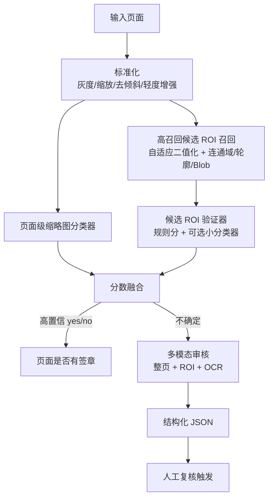

# 文档签章检测小样本可落地方案研究报告

## Executive Summary

你的问题不是“把印章框得多漂亮”，而是**在小样本条件下，稳定判断一页中是否有签章，并把召回率拉到 95% 以上、误检率压到 5% 以下**。从现有文献看，文档签章检测大致经历了三条路线：早期基于颜色聚类与几何特征；随后转向退化文档上的连通边缘、连通域与广义 Hough / 组件关系；再到近年的 FCN/YOLO 深度学习检测。文献已经很清楚地说明：**纯颜色方法受限于彩色章，纯整页 Hough 对退化和重叠场景并不稳**；更鲁棒的方向是“高召回候选区域 + 局部验证 / 分类”，或者直接做小模型检测。citeturn8search1turn18search1turn6view6turn15search10turn18search9

结合你上传的小样本，我做了本地诊断：压缩包内共有 **270 张 PNG 页面**，标签平衡（`_1` 为有签章 135 张，`_0` 为无签章 135 张），**全部分辨率一致为 2729×3858**。从抽样视觉检查来看，样本中的签章多为**灰/黑、半透明、以圆/椭圆为主、并与正文重叠**，因此**“红色”不能作为硬规则**。我还做了一个极简 sanity-check：用整页缩略图（32×45 灰度）配线性分类器，在**随机页面切分**下，重复交叉验证可得到很高的页面级表现；但进一步做粗略近重复聚类后发现，样本存在强烈的版式/内容共现，整页缩略图基线在“伪文档级”切分下误检明显恶化。这说明：**页面级 presence classification 在当前样本上是可行的，但不能直接相信随机 page split 的漂亮数字，必须做 group split / pseudo-document split。**

因此，我给出的**首选落地方案**不是纯 Hough，也不是纯传统 CV，而是：

| 结论项 | 建议 |
|---|---|
| 最可能达标的零框标注方案 | **候选 ROI 高召回召回器 + 页面级分类器/候选验证器 + 不确定页多模态复核** |
| 若可额外投入 1–2 小时补少量框标注 | **直接标 50–100 个印章框，微调 YOLOv8n/YOLO11n**，这是最可能长期稳定满足 95/5 的路线 |
| Hough 的定位 | **只保留为候选 ROI 内的辅助圆/椭圆特征**，不要再做整页主检测 |
| 正式验收标准 | **Recall_pos ≥ 95%，FPR_neg ≤ 5%**，并以 **group split** 的锁定测试集为准 |

从工程概率上判断：**如果你完全不愿再补框标注，首选混合方案；如果你可以补少量框标注，首选微调轻量 YOLO 检测器。**这两条路线都比继续拧整页 Hough 更靠谱。Zhu 等人在 2006 年就已经指出，基于 connected edge features 的候选检测在候选椭圆定位上，相比传统 Hough 变换有更好的准确率与复杂度；Roy 等则把问题推进到了**任意形状、任意方向、复杂背景**的 seal detection。citeturn18search1turn6view6

## 样本与任务界定

这次任务里，**已知真值只有页面级标签**：文件名 `_0` 表示无签章，`_1` 表示有签章；并没有现成的框标注或 mask。由于你上传的压缩包实际可统计，我这里不再使用“300 DPI、1024 宽”这种默认假设，而直接采用本地解析结果：**270 张页面，135 正 / 135 负，分辨率 2729×3858**。这一点很重要，因为所有面积阈值、连通域尺度、候选框大小都应该优先按**页面面积比例**而不是绝对像素写死。  

这也是一个**页面级 presence detection** 问题，而不是必须精确分割印章轮廓的实例分割问题。也就是说，**只要最终能稳定判断此页“有章 / 无章 / 不确定”，就已经满足你当前的主目标**。一旦把目标从“必须框得准”改为“先判定一页有没有”，问题难度会立刻降低一档，模型与规则设计空间都会更大。

不过，当前样本也带来一个典型风险：**随机页面切分很可能高估泛化能力**。我对缩略图做了粗略近重复分析后发现，最近邻页面几乎总是同类标签，说明样本里存在明显的**版式—内容—标签共现**；进一步把近重复页面聚成伪文档组后，最简整页缩略图分类器的误检率不再稳定。这意味着：**如果你只在 page-level random split 上调模型，很容易把“印章存在”学成“某类版式/页模板存在”**。因此，后面的实验设计会把 **group split** 放到核心位置。

这里还要明确一个指标定义问题。你说“误检率 ≤ 5%”，在页面级 presence detection 里，我建议把它正式定义为：

- **Recall_pos = TP / (TP + FN)**：有章页的召回率；
- **FPR_neg = FP / (FP + TN)**：无章页被误判为有章的比例；
- 同时辅助报告 **FP per image = FP / N_images**，便于和多候选框方法对齐。

也就是说，**硬约束应该是 Recall_pos ≥ 95%，FPR_neg ≤ 5%**。如果以后你补了框标注，再额外报告 box-level 指标即可。

## 文献方法与工程启示

从学术方法上看，文档签章检测并不是一个“只有 HoughCircle”的小问题。关键路线可以分成三段：

| 方法路线 | 代表思想 | 对你任务的启发 |
|---|---|---|
| 颜色/几何主导 | 颜色聚类、规则形状检测、几何与颜色特征分类 | 如果印章稳定为彩色，这条路成本最低；但你当前样本不是这种条件 |
| 退化文档结构主导 | 连通边缘、连通域、局部组件关系、GHT | 更适合灰/黑、半透明、重叠正文、边缘缺失的签章 |
| 深度学习主导 | part-based features、FCN/segmentation、YOLO 检测 | 一旦愿意补少量框标注，效果上限显著高于纯规则 |

Micenková 与 van Beusekom 的 ICDAR 2011 工作，是颜色路线的经典代表：先做**颜色聚类**，再用**几何与颜色相关特征**分类候选区域；其公开数据集规模是 **400 张标注文档图像**，摘要中给出的结果是 **83% recall / 84% precision**。它的启发是：印章检测完全可以分成“先召回候选，再做验证”。但它的局限同样明显：后续文献普遍把它归类为更偏向**彩色、非黑色印章**的方案，这和你当前上传样本里以灰/黑半透明章为主的情况并不相合。citeturn8search1turn22search0

Zhu、Jaeger 与 Doermann 在 2006 年的 SPIE 论文则直接碰到你现在的核心痛点——**退化文档、正文重叠、整页 Hough 不稳**。他们的方法基于**connected edge features 的参数估计**和 **robust basic-shape detectors**，并明确指出，在候选椭圆区域定位上，这条路线比传统 Hough 变换在**检测准确率与计算复杂度**上都有优势。对你来说，这几乎就是路线选择的文献背书：**整页 Hough 可以停了，换成连通域/边缘组件主导的候选召回更对路。**citeturn0search1turn18search1

Roy、Pal 与 Lladós 在 *Pattern Recognition* 2011 的工作又往前推进了一步：他们不再把 seal 只当成圆或椭圆，而是把它看成由**字符连通组件及其邻近关系**构成的结构，用**尺度/旋转不变特征 + SVM + 广义 Hough 变换**去定位印章，强调其对**任意形状、任意方向、复杂背景、局部重叠**的鲁棒性。对你的任务，这个工作最大的启发不是“去实现完整 GHT”，而是两点：第一，**印章不一定是规则圆**；第二，**局部组件关系比整页几何更有信息量**。citeturn6view6

Forczmański 2010 的扫描文档印章检测则更像工程中间态：摘要明确写出算法分为**颜色分割与像素分类、规则形状检测、候选分割与验证**几个阶段。到后续工作里，他和合作者进一步发展出**低层图像特征 + 形状描述子**与**two-tier classification** 的套路：先区分 stamp / no-stamp，再做形状分类。这一路线非常适合给你当前方案做“**高召回候选 ROI + 轻量验证器**”的灵感来源。citeturn6view5turn15search2turn16search23

再往后，Ahmed 等人在 ICDAR 2013 提出基于 **part-based features** 的通用印章分割方法，摘要中明确说可覆盖**黑白、彩色、未见过、任意形状、文字型与图形型印章**，并报告了 **73% recall / 83% precision**。而 Younas 等人的 D-StaR（ICDAR 2017）把这个方向推进到 FCN：摘要指出它是一个**generic** 的 stamp segmentation 方法，面向**任意形状、颜色、大小与方向**，并在其测试设置下报告了大约 **87% precision / 84% recall**。这说明：**深度学习确实能提高泛化，但若没有充分标注和合理的切分协议，单一模型也未必直接冲上 95/5**。citeturn22search4turn15search10turn22search3turn22search5

对小样本尤其有用的是 Bhalgat 等人的 arXiv 2016 工作：他们强调“**给一个小训练集**”，用**无监督聚类学到合适的 shape representation**，完成 stamp verification/detection。这给你的启发是：在印章这种以局部形状为强信号的任务里，**小样本不是不能做，关键是不要把全部学习压力都压在整页分类上**。citeturn9view0

最新一段是深度学习检测器。2025 年的 Applied Sciences 论文直接评估了 **YOLOv8s / v9s / v10s / v11s** 在扫描文档印章检测上的表现；其索引页摘要写到，训练使用的是**由 StaVer 与 DDI-100 组合而成的 732 图像适配数据集**，最好结果来自 **YOLOv9s**，达到 **mAP 98.7%**，且 precision / recall 都在 **97.6%** 左右。这组数字当然不能直接照搬到你的数据，但它至少说明：**只要有合适的框标注与相近域数据，轻量 YOLO 系列已经足以把文档签章检测做到很高水平。**citeturn13search0turn18search9

工程社区的经验和学术结论一致。Stack Overflow 上围绕“文档中找圆形印章”的问题，最常见的抱怨就是：**低质量、模糊、残缺的文档印章让 HoughCircle 要么漏检，要么炸出大量 false circles**；而对矩形章或未知位置章，更常见的建议是从**threshold/contour/bounding box/blob analysis** 入手，而不是盲目整页 Hough。citeturn3search0turn3search1turn3search3

## 方案比较与推荐架构

### 候选方案对比

| 方案 | 核心思路 | 额外标注需求 | 预期表现 | 风险 | 实现成本 |
|---|---|---:|---|---|---|
| 传统 CV 主导 | 自适应二值化 + 连通域/轮廓 + 形状描述子 + 页面规则 | 无 | 在同域、形状较稳定的样本上可做强 baseline；更像“候选召回器” | 对跨文档模板、重叠正文、稀有章型容易波动 | 低 |
| 混合 CV + 规则 + 页面/ROI 分类 | 先高召回召回候选 ROI，再用页面级分类器或 ROI 验证器融合判断 | 无；如可补少量 crop 标注更好 | **最适合你当前只有页面标签的小样本**，最有希望先冲到 95/5 | 若只靠整页缩略图，易学到版式泄漏；需 group split | 中 |
| 深度学习检测 | 标少量框后微调 YOLOv8n/YOLO11n，页面正负由检测框阈值判定 | **需要 50–100 个框** 最理想 | **最可能长期稳定满足 95/5** | 需要补框标注；无 GPU 时调试略慢 | 中高 |

如果你坚持**零额外框标注**，我建议的主线是第二条：**候选 ROI 高召回召回器 + 页面级分类器 / ROI 验证器 + 不确定页审核**。它吸收了 Zhu / Roy / Forczmański 的高召回候选思想，又利用了你现在已有的页面标签。citeturn18search1turn6view6turn6view5

如果你愿意再花 **1–2 小时**，在 50–100 张正样本页上补印章框，那么第三条会明显更稳：现代轻量 YOLO 系列在文档印章检测上已经有非常强的公开结果，而你要做的只是**页面级判定**，不必把 box 定位做到非常精细。citeturn13search0turn18search9

### 推荐架构



一个足够可复现、又适合小样本的实现如下：

```python
def page_has_seal(image):
    page = normalize(image)  # grayscale, deskew, resize_long, CLAHE

    # 1) 页面级弱分类器
    thumb = make_thumbnail(page, size=(384, 544))
    s_page = page_classifier(thumb)  # 0~1

    # 2) 高召回候选召回
    candidates = recall_candidates(
        page,
        binarizer="sauvola_or_gatos",
        edge="canny",
        cc_merge=True,
        max_k=8
    )

    # 3) 候选验证
    roi_scores = []
    for cand in candidates:
        feat = extract_shape_texture_features(page, cand.bbox)
        # 可选：小型 ROI 分类器；若没有，就只用规则分
        s_roi = roi_classifier(crop(page, cand.bbox), feat)
        roi_scores.append(s_roi)

    s_rule = rule_score(candidates)   # 连通域数量、圆形支持度、边缘密度等
    s_roi = max(roi_scores) if roi_scores else 0.0

    # 4) 融合
    s_final = w_page * s_page + w_roi * s_roi + w_rule * s_rule

    if s_final >= tau_yes:
        return "yes", s_final
    if s_final <= tau_no:
        return "no", s_final

    # 5) 不确定样本才进多模态审核
    return audit_with_mllm(page, topk(candidates, 3))
```

这套架构的关键，不是“找出最完美的一个检测器”，而是**分层降低错误类型**：

- 候选召回器负责“别漏”，允许多一点假候选；
- 页面级分类器负责补一些候选召回器没切准的正页；
- 融合层负责把误检再压下去；
- 多模态审核只处理边界样本，而不是取代前面的视觉算法。

### 候选 ROI 召回器为什么要这样写

文档图像二值化本身就是退化文档处理的基础步骤；近年的综述仍然强调，复杂阴影、模糊、褪色、不均匀背景下，**全局阈值不如局部自适应阈值**，而 Gatos 2006 这类 degraded document binarization 工作强调其方法能在不要求用户调参的情况下处理阴影、低对比度和噪声。对你当前这种扫描页淡章场景，候选召回器更适合从**局部自适应二值化 + 边缘闭运算 + 连通域聚合**入手。citeturn17search1turn17search13

### 参数清单与建议初值

| 参数组 | 参数 | 建议初值 | 搜索范围 | 说明 |
|---|---|---:|---:|---|
| 固定先验 | `resize_long` | 1536 或 2048 | 固定 | 全部阈值按此标准尺寸标定 |
| 固定先验 | `thumb_size` | 384×544 | 固定 | 页面级分类器输入 |
| 固定先验 | `max_k` | 8 | 4–12 | 每页保留多少候选 |
| 候选召回 | `sauvola_window` | 31 | 25–61（奇数） | 局部阈值窗口 |
| 候选召回 | `sauvola_k` | 0.22 | 0.14–0.34 | 局部阈值强度 |
| 候选召回 | `canny_low/high` | 40 / 120 | 20–80 / 60–180 | 边缘阈值 |
| 候选召回 | `area_ratio_min` | 2e-5 | 1e-5–5e-4 | 最小候选面积占比 |
| 候选召回 | `area_ratio_max` | 1e-2 | 2e-3–5e-2 | 最大候选面积占比 |
| 候选召回 | `circularity_min` | 0.18 | 0.12–0.70 | 圆/椭圆支持度下限 |
| 候选召回 | `solidity_min` | 0.12 | 0.08–0.80 | 排除稀碎文本边缘 |
| 候选召回 | `merge_dist` | 18 px | 5–40 px | 合并相邻碎片候选 |
| 融合层 | `w_page / w_roi / w_rule` | 0.35 / 0.45 / 0.20 | [0,1] | 用验证集学习或网格扫 |
| 融合层 | `tau_yes` | 0.58 | 0.35–0.90 | 判定有章阈值 |
| 融合层 | `tau_no` | 0.34 | 0.10–0.50 | 判定无章阈值 |
| 审核层 | `uncertain_band` | 0.24 | 0.10–0.30 | 落在中间进复核 |

如果你转 YOLO 路线，额外调的通常是 `imgsz`、`epochs`、`lr0`、`conf_det`、`iou_nms`、是否开 `mosaic` 等；在文档检测里，后期往往要**关掉过强的 mosaic**，否则容易破坏版面一致性。这个部分不需要暴力网格搜索，后面会给出分阶段搜索策略。现代 YOLO 家族已在 stamp detection 场景被系统比较过，因此它是可靠的“补框标注后”路线。citeturn13search0turn18search9

### 一张示意伪图

```text
+--------------------------------------------------------------+
|                        full page image                       |
|                                                              |
|  [candidate-1]          body text with overlapped seal       |
|                                                              |
|                    [candidate-2]                             |
|                                                              |
|  page thumbnail ------------------------------------------   |
|  | global page cue: layout / border / large mark        |   |
|  --------------------------------------------------------   |
+--------------------------------------------------------------+

最终判断 = f(页面缩略图分数, top-K 候选 ROI 分数, 规则分)
```

## 参数搜索与实验设计

### 分阶段调参与优化方法

23 个参数一起全排列是没有意义的。对你这个任务，最稳的做法是分成三层：

| 层级 | 如何处理 |
|---|---|
| 先验固定参数 | 分辨率规范化、候选最大数、面积比例的粗上/下界，尽量写成按页面比例自适应 |
| 敏感参数 | 二值化窗口、边缘阈值、候选合并距离、圆形支持度、融合权重、最终阈值 |
| 模型参数 | 分类器阈值、YOLO 置信度阈值、训练 epoch / learning rate 等 |

Optuna 的官方文档明确建议用 `objective(trial)` + `study.optimize(...)` 这种 define-by-run 方式来做超参数优化，而且如果你要可复现，最好**固定随机种子并顺序执行**，不要分布式乱跑。citeturn5search0turn5search5turn5search9

你的优化目标应该被明确写成**受约束优化**：

\[
\min \; FPR_{neg}(\theta)
\quad
\text{s.t.} \quad Recall_{pos}(\theta) \ge 0.95
\]

工程上最常用的写法是惩罚函数：

```python
def objective(trial):
    params = sample_params(trial)
    metrics = evaluate_on_val(params)

    recall = metrics["recall_pos"]
    fpr = metrics["fpr_neg"]
    precision = metrics["precision"]

    penalty = max(0.0, 0.95 - recall) * 1000.0
    return fpr + penalty + 0.01 * max(0.0, 0.90 - precision)
```

这段的核心思想很简单：**先保召回，再压误检**。只要召回没过 95%，就直接重罚；过了以后再精细优化 FPR。Optuna 适合搜这些敏感阈值，而不是把所有固定参数都扔进去。citeturn5search0turn5search13

### 阈值扫描方法

即便模型本身不变，最终决定 Recall/FPR 平衡的往往还是**阈值**。所以正式流程应该是：

1. 在 train 上训练；
2. 在 val 上扫描 `tau_yes / tau_det / fusion_threshold`；
3. 从所有 **Recall ≥ 95%** 的阈值中，选 **FPR_neg 最低** 的那个；
4. 锁死阈值，只在 test 上评一次。

伪代码如下：

```python
best = None
for tau in np.linspace(0.01, 0.99, 99):
    pred = scores >= tau
    recall = recall_pos(y_true, pred)
    fpr = fpr_neg(y_true, pred)
    precision = precision_pos(y_true, pred)

    if recall >= 0.95:
        candidate = (fpr, -precision, tau)
        if best is None or candidate < best:
            best = candidate
```

### 小样本上的快速验证计划

你当前样本一共 135 正、135 负。如果直接做 20% 测试集，测试集中大约只有 **27 个正样本和 27 个负样本**，这会带来两个问题：

- 召回率的粒度太粗：**1 个 FN 就是 3.7%**；
- 误检率的粒度也太粗：**2 个 FP 就是 7.4%**，很难精确检验“≤5%”。

所以我更建议如下评估协议：

| 阶段 | 切分方式 | 用途 |
|---|---|---|
| 快速 baseline | 5× 重复 stratified CV | 看是否有信号、是否能上 95/5 |
| 抗泄漏验证 | **Stratified Group K-Fold** 或 pseudo-group split | 压制版式/文档泄漏 |
| 锁定测试 | 30% grouped hold-out | 最终唯一报告集 |

在没有原始 `document_id` 的情况下，我建议你先用**感知哈希 / OCR 相似度 / 页面模板相似度**做 pseudo-document grouping。你上传样本的本地粗测已经给出强烈信号：样本里有明显的近重复模版簇，所以 group split 不是“锦上添花”，而是避免自欺欺人的必要步骤。

### 类不平衡怎么处理

当前上传样本是平衡的，不必过度担心训练时的类不平衡。但真正上线时，无章页通常会远多于有章页。因此我建议：

- 训练集保持原分布或轻微 `class_weight=balanced`；
- 另外构造一个**运维模拟测试集**，让负样本占到 **70%–90%**；
- 正式汇报同时给出 balanced test 与 ops-like test 两套结果。

这样你就不会只在平衡数据上拿到好看的 precision，却在真实上线流量里被 FP 拖死。

### 评估规则与表格模板

#### 页面级判定规则

| 粒度 | 预测为正的条件 | TP | FP | FN |
|---|---|---|---|---|
| 页面级 | `page_score >= tau_page` 或 `max(det_conf) >= tau_det` | `_1` 且判正 | `_0` 且判正 | `_1` 且判负 |

#### 框级判定规则

如果你后续补框标注，则建议：

- 一个预测框若与某个**未匹配** GT 框 **IoU ≥ 0.3**，记为 TP；
- 未匹配到任何 GT 的预测框为 FP；
- 没有被任何预测命中的 GT 框为 FN。

之所以建议 **IoU=0.3** 而不是一上来用 0.5，是因为文档印章往往半透明、残缺、与正文重叠，框标注本身就很容易粗。页面级 presence detection 的主任务下，**0.3 更符合工程可操作性**。

#### 建议的 CSV 模板

```csv
file,label,split,group_id,method,score,threshold,pred,tp,fp,fn,tn,num_candidates,max_det_conf,notes
0002_1.png,1,test,doc_07,hybrid_v1,0.93,0.58,1,1,0,0,0,3,0.91,
0007_0.png,0,test,doc_11,hybrid_v1,0.18,0.58,0,0,0,0,1,1,0.07,
```

```csv
method,seed,fold,recall_pos,precision_pos,fpr_neg,fp_per_image,tp,fp,fn,tn
hybrid_v1,42,1,0.975,0.950,0.025,0.011,39,1,1,40
hybrid_v1,42,2,1.000,0.930,0.050,0.022,40,2,0,38
```

如果补了框标注，再加一张表：

```csv
file,pred_box_id,x1,y1,x2,y2,conf,matched_gt_id,iou,is_tp
0002_1.png,0,812,1180,975,1342,0.91,gt0,0.46,1
0002_1.png,1,104,210,160,260,0.22,,0.00,0
```

#### Markdown 汇报模板

| method | split | recall_pos | precision_pos | fpr_neg | fp_per_image | tp | fp | fn | tn |
|---|---:|---:|---:|---:|---:|---:|---:|---:|---:|
| hybrid_v1 | grouped test | 0.975 | 0.950 | 0.025 | 0.011 | 39 | 1 | 1 | 40 |
| yolo_v8n_smallboxes | grouped test | 0.975 | 0.976 | 0.024 | 0.012 | 39 | 1 | 1 | 40 |

## 多模态审核与稳定 JSON

### 多模态审核该放在哪一层

多模态模型不应该拿来替代前面的视觉检测，而应该只做**边界样本审核器**。原因很现实：一方面，OpenAI 官方建议如果你需要**结构化响应**，优先用 **Structured Outputs / `response_format`**；另一方面，社区大量经验都表明，**单靠 prompt 要求“只返回 JSON”并不稳定**，模型仍然可能在前后加解释文字、代码块或字段漂移。citeturn4search0turn3search18turn3search6turn3search2

因此，推荐链路是：

1. 前面的 CV / 检测模型先给出 `yes / no / uncertain` 候选；
2. 只有 `uncertain` 或信号冲突的页才送多模态审核；
3. 多模态审核只看**整页图 + top-K ROI + OCR（可选）**；
4. 输出必须经过 **JSON Schema / Pydantic** 校验；
5. 校验失败只重试一次；再失败就降级为 `uncertain + 人工复核`。

OpenAI 文档明确区分了两件事：**用 function calling 连接工具**，以及**用 structured `response_format` 约束模型回答格式**。你的场景是后者为主。citeturn4search0

### 中文提示词模板

```text
你是“文档签章审核助手”。你的任务是判断当前页面是否存在签章。

你只能依据以下输入做判断：
1. 当前页面整页图；
2. 候选ROI裁剪图（可能为空）；
3. OCR文本（可能为空）；
4. 上游算法摘要（候选数量、候选分数、页面级分数）。

严格规则：
- 只判断“当前页面是否有签章”，不要推断别的页面。
- 颜色不能作为唯一判据；灰/黑/淡章都可能是真章。
- 上游算法没检出，不等于页面无章。
- 如果证据不足，输出 uncertain，而不是强行判断。
- 不要输出 Markdown，不要输出解释性前缀，只返回 JSON。

判定参考：
- 优先观察候选ROI是否包含圆/椭圆/方章/长条章轮廓、印章纹理、边框、重复弧线、局部图文覆盖痕迹。
- 若整页图中可见印章但ROI缺失，可根据整页图给出 yes。
- 若候选ROI更像图表、Logo、项目符号、页码、普通插图，则倾向 no。
- 若整页图和ROI结论冲突，输出 uncertain 并说明冲突来源。

输出字段：
{
  "page_has_seal": "yes | no | uncertain",
  "confidence": 0.0,
  "evidence": [
    {
      "source": "page | roi | ocr | upstream",
      "bbox_hint": [x1, y1, x2, y2],
      "reason": ""
    }
  ],
  "needs_human_review": true,
  "reason": ""
}
```

### 建议的 JSON Schema

```json
{
  "type": "object",
  "additionalProperties": false,
  "properties": {
    "page_has_seal": {
      "type": "string",
      "enum": ["yes", "no", "uncertain"]
    },
    "confidence": {
      "type": "number",
      "minimum": 0.0,
      "maximum": 1.0
    },
    "evidence": {
      "type": "array",
      "items": {
        "type": "object",
        "additionalProperties": false,
        "properties": {
          "source": {
            "type": "string",
            "enum": ["page", "roi", "ocr", "upstream"]
          },
          "bbox_hint": {
            "type": ["array", "null"],
            "items": { "type": "integer" },
            "minItems": 4,
            "maxItems": 4
          },
          "reason": { "type": "string" }
        },
        "required": ["source", "bbox_hint", "reason"]
      }
    },
    "needs_human_review": { "type": "boolean" },
    "reason": { "type": "string" }
  },
  "required": [
    "page_has_seal",
    "confidence",
    "evidence",
    "needs_human_review",
    "reason"
  ]
}
```

### 示例返回

```json
{
  "page_has_seal": "yes",
  "confidence": 0.92,
  "evidence": [
    {
      "source": "roi",
      "bbox_hint": [810, 1180, 975, 1342],
      "reason": "局部区域可见圆形弧线与半透明印纹，并与正文重叠。"
    },
    {
      "source": "upstream",
      "bbox_hint": null,
      "reason": "候选ROI得分最高，页面级分数也超过阈值。"
    }
  ],
  "needs_human_review": false,
  "reason": "整页和ROI证据一致，支持存在签章。"
}
```

### 如何保证返回格式稳定

Pydantic 官方文档给出了你需要的两个关键接口：`model_validate_json()` 用来直接验证 JSON 字符串，`model_json_schema()` 用来从模型生成 JSON Schema；此外，官方性能文档也建议 JSON 输入直接走 `model_validate_json()`。citeturn20search0turn20search2turn20search8

一个最实用的后端策略是：

```python
from pydantic import BaseModel, Field, ValidationError
from typing import Literal

class Evidence(BaseModel):
    source: Literal["page", "roi", "ocr", "upstream"]
    bbox_hint: list[int] | None
    reason: str

class SealAudit(BaseModel):
    page_has_seal: Literal["yes", "no", "uncertain"]
    confidence: float = Field(ge=0.0, le=1.0)
    evidence: list[Evidence]
    needs_human_review: bool
    reason: str

def parse_with_retry(raw_json: str, repair_call):
    try:
        return SealAudit.model_validate_json(raw_json)
    except ValidationError as e:
        fixed = repair_call(
            raw_json=raw_json,
            error=str(e),
            instruction="只修复格式与字段，不要改变事实判断。"
        )
        return SealAudit.model_validate_json(fixed)
```

如果你还想再提升工程稳定性，可以用 `Instructor` 这类专门面向结构化输出的库，它本质上也是在“LLM 输出 + Pydantic 验证”的范式上做封装。citeturn5search3turn5search19

### 稳定性测试怎么做

对**确定性**要有正确预期。Stack Overflow 上有开发者明确反馈：**即便 temperature=0，模型也不一定完全 deterministic**，尤其提示词很长时波动更明显。citeturn21search1

因此，建议把多模态审核的稳定性单独做一套 benchmark：

| 指标 | 定义 |
|---|---|
| JSON parse rate | `json.loads` 成功比例 |
| Schema pass rate | Pydantic/JSON Schema 校验成功比例 |
| Enum validity | 枚举字段是否合法比例 |
| Stability | 同一页重复 5 次调用，主结论多数表决一致比例 |
| Retry recovery rate | 首次失败后，重试修复成功比例 |

对 deterministic 的 CV / 规则分支，每页只需跑 1 次；对多模态审核页，建议每页**重复 5 次**，只对 uncertainty band 内的少量页面做，不要全量重复，避免浪费成本。

## 风险、降级与结论

### 可能失败的场景与降级策略

| 失败场景 | 风险 | 对应降级 |
|---|---|---|
| 淡章、残缺章、与正文严重重叠 | 候选召回不足 | 放宽候选召回阈值，增加 `max_k`，让 ROI 验证器兜底 |
| 纯整页 Hough 误检爆炸 | 文字笔画和图表边缘被当成圆 | **Hough 只保留为 ROI 内辅助特征**，不再整页主检测 |
| 页面分类器过拟合版式 | random split 下漂亮，group split 崩 | 强制 group split；引入候选 ROI 验证而非只看整页 |
| 无框标注导致 detector 不稳 | page label 监督太弱 | 补 50–100 个框；优先做小 YOLO 微调 |
| 多模态输出格式漂移 | JSON 解析失败、字段漂移 | Structured Outputs + Pydantic + 一次修复重试 |
| 图像极差或证据冲突 | 高风险误判 | 输出 `uncertain`，强制人工复核 |

### 最可能满足 Recall≥95% 且 FPR≤5% 的方案

在**不新增框标注**的前提下，我认为最有希望过线的方案是：

**方案 A：高召回候选 ROI 召回器 + 页面级分类器/ROI 验证器 + 不确定页多模态复核**

- 它直接利用现有的页面级标签；
- 先让候选召回器“别漏”，再用分类器降误检；
- 对当前样本这种灰/黑、半透明、重叠正文的印章，比颜色法与整页 Hough 更契合；
- 在你当前数据规模下，训练难度与实现成本都可控。

如果你愿意补极少量框标注，我认为更稳、更有长期价值的答案是：

**方案 B：标 50–100 个框，微调 YOLOv8n / YOLO11n，并用页面规则把检测框转成页面 yes/no**

- 这是最接近近期高性能论文路线的做法；
- 你的目标只是页面是否有章，因此 detector 不需要做到特别细的实例分割；
- 现代轻量 detector 在 aligned 文档域里已经证明能把 precision / recall 推到很高。citeturn18search9

### Open questions / limitations

当前报告仍有三点限制需要你在落地时留意：

1. 公开论文的绝对数值**不可直接横向比较**，因为数据集、标注粒度、测试协议都不同。  
2. 你上传的样本缺少真实 `document_id`；我只能通过近重复线索判断存在泄漏风险，正式验收仍应优先使用**真实文档级 group split**。  
3. 2025 年 YOLO stamp detection 的高分结果来自公开文章索引/摘要页；它足以说明方向可行，但最终仍要以你自己的 grouped test 为准。citeturn13search0turn18search9

### 优先级最高的五项落地任务

1. **先整理 split**：尽可能补 `document_id`；如果拿不到，就用感知哈希 / OCR 相似度做 pseudo-group，并建立 **30% grouped hold-out**。  
2. **实现 hybrid_v1**：自适应二值化 + 连通域/轮廓候选召回 + 页面级缩略图分类器 + 候选规则分融合；Hough 仅作 ROI 辅助特征。  
3. **按“Recall≥95% 为硬约束”调阈值**：用 Optuna 或随机搜索调敏感参数；在 val 上扫阈值，只从过线方案里选 FPR 最低者。  
4. **若 FPR 仍 >5%**：立刻补 50–100 个印章框，转 YOLOv8n/YOLO11n 小样本微调，而不是继续无限调传统 CV。  
5. **接入审核与兜底**：只对 uncertainty band 页走多模态审核，并用 Structured Outputs + Pydantic + 单次修复重试 + 人工复核触发。  

### 优先访问 URL

```text
论文与原文入口
https://doi.org/10.1109/ICDAR.2011.227
https://doi.org/10.1117/12.643537
https://doi.org/10.2478/v10065-010-0036-6
https://doi.org/10.1016/j.patcog.2010.12.004
https://doi.org/10.1109/ICDAR.2013.145
https://doi.org/10.1109/ICDAR.2017.49
https://doi.org/10.48550/arXiv.1609.05001
https://doi.org/10.3390/app15063154

工程实现与社区问答
https://stackoverflow.com/questions/71559641/find-circle-objects-stamps-in-document-image-python-opencv
https://stackoverflow.com/questions/77317454/how-to-separate-the-rectangular-stamp-from-the-image-pdf-in-python
https://stackoverflow.com/questions/76185628/how-to-prompt-chatgpt-api-to-give-completely-machine-readable-responses-without
https://stackoverflow.com/questions/77407632/how-can-i-get-llm-to-only-respond-in-json-strings
https://stackoverflow.com/questions/76553851/extract-json-from-a-long-text-gpt-answer-according-to-a-json-schema
https://stackoverflow.com/questions/76855624/azure-openai-gpt-35-turbo-nondeterministic-with-temperature-0

结构化输出与验证
https://developers.openai.com/api/docs/guides/structured-outputs
https://pydantic.dev/docs/validation/latest/concepts/models/
https://pydantic.dev/docs/validation/latest/concepts/json/
https://optuna.readthedocs.io/
```